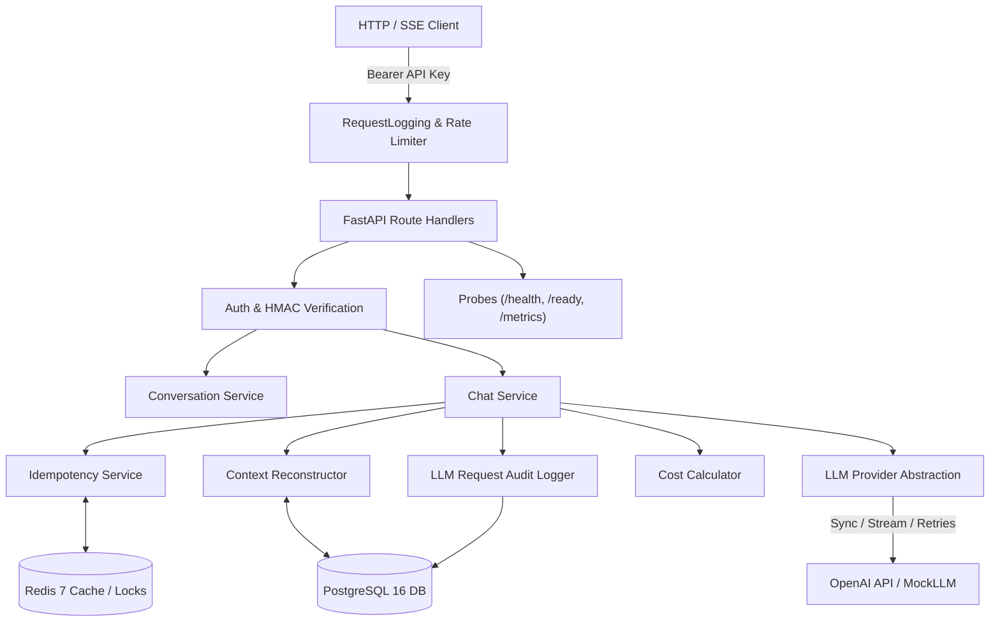

# AI Chatbot API (Project 1)

[](https://www.python.org/downloads/)
[](https://fastapi.tiangolo.com/)
[](https://www.postgresql.org/)
[](https://redis.io/)
[](https://www.docker.com/)

A production-grade, multi-tenant AI Chat API built on FastAPI, PostgreSQL 16, Redis 7, and OpenAI. Engineered with robust resilience, sliding-window rate limiting, distributed idempotency, structured JSON logging, low-cardinality metrics, deterministic evaluation datasets, and production-hardened Docker containers.

---

## 1. Architecture Overview



---

## 2. Core Capabilities

1. **Strict Multi-Tenant Isolation**:
   - API keys are hashed deterministically using HMAC-SHA-256 with server-side secret peppering. Raw keys are never stored.
   - Every conversation, message, rate limit, and idempotency key is strictly partitioned by authenticated tenant ID.
2. **Synchronous & SSE Streaming Chat**:
   - Synchronous `POST /api/v1/conversations/{id}/messages` with token accounting, cost calculation, and latency tracking.
   - Server-Sent Events (SSE) `POST /api/v1/conversations/{id}/messages/stream` supporting real-time token delivery, TTFT tracking, and client disconnect cancellation cleanup.
3. **Resilience & Retry Engine**:
   - Exponential backoff with full jitter for transient provider failures (HTTP 429, 500, 502, 503, 504, connection drops).
   - Configurable per-call timeouts and max retries.
4. **Distributed Sliding-Window Rate Limiting**:
   - Atomic Lua-scripted sliding window in Redis (default: 100 requests/minute/tenant).
   - Injects standard RFC rate limit headers (`X-RateLimit-Limit`, `X-RateLimit-Remaining`, `X-RateLimit-Reset`).
   - Configurable fail-closed vs fail-open fallback policies.
5. **Distributed Idempotency Engine**:
   - Two-phase distributed lock + payload caching in Redis (`X-Idempotency-Key`).
   - Prevents duplicate message persistence and duplicate LLM billing on retried requests.
6. **Structured Logging & Redaction**:
   - `structlog` integration with context-bound correlation IDs (`X-Request-ID`).
   - Automatic redaction of API keys, bearer tokens, passwords, and user message content.
7. **In-Memory Bounded Metrics**:
   - Bounded-cardinality counters and histograms exposed at `GET /metrics` for HTTP, LLM (tokens, costs, TTFT), and infrastructure operations.
8. **Health & Readiness Probes**:
   - `GET /health`: Lightweight liveness probe (0 external dependencies).
   - `GET /ready`: Deep readiness probe verifying PostgreSQL and Redis with 2s timeouts (returns 200 when ready, 503 when degraded).
9. **Synthetic Seed Dataset**:
   - Realistic synthetic seed generator (`scripts/build_seed_data.py`) with 50+ diverse conversations across 10 domains.
10. **Evaluation & Benchmarking**:
    - 10-category deterministic evaluation dataset (`evaluation/dataset.json` + `scripts/run_evals.py`).
    - Sub-50ms P95 overhead performance benchmark suite (`scripts/run_benchmarks.py`).

---

## 3. Technology Stack

| Component | Technology | Description |
|---|---|---|
| **Runtime** | Python 3.12 | Modern typed asynchronous Python |
| **API Framework** | FastAPI + Uvicorn | High-performance ASGI framework |
| **Database** | PostgreSQL 16 | Relational store with ACID transactions |
| **ORM / Driver** | SQLAlchemy 2.0 + asyncpg | Pure async ORM and PostgreSQL driver |
| **Migrations** | Alembic | Async database schema migrations |
| **Cache & Limiting** | Redis 7 + redis-py | Distributed sliding window, locks, idempotency |
| **LLM Provider** | OpenAI API / Mock Provider | `gpt-4o-mini`, `gpt-4o`, deterministic mock |
| **Logging** | Structlog | JSON structured logging with redaction |
| **Lint / Type Check** | Ruff + strict Mypy | Zero lint errors, strict typing compliance |
| **Containerization** | Docker + Docker Compose | Multi-stage build with non-root security |

---

## 4. Getting Started

### 4.1 Prerequisites
- Python 3.12+
- Docker & Docker Compose
- Git

### 4.2 Local Setup
```powershell
# Clone the repository
git clone https://github.com/shubhpanchal/Ai-Chatbot.git
cd Ai-Chatbot

# Create and activate virtual environment
python -m venv .venv
.\.venv\Scripts\Activate.ps1

# Install package with all dev dependencies
pip install -e ".[dev]"

# Copy environment template
cp .env.example .env
```

### 4.3 Running with Docker Compose
```powershell
# Build and start PostgreSQL, Redis, and FastAPI API
docker compose up -d --build

# Verify running containers
docker compose ps
```

The API will be accessible at:
- **API Base**: `http://localhost:8001`
- **Swagger Docs**: `http://localhost:8001/docs`
- **Liveness Probe**: `http://localhost:8001/health`
- **Readiness Probe**: `http://localhost:8001/ready`
- **Metrics Endpoint**: `http://localhost:8001/metrics`

---

## 5. Database Setup & Seeding

### 5.1 Run Migrations
```powershell
alembic upgrade head
```

### 5.2 Seed Synthetic Dataset (50+ Conversations)
```powershell
python scripts/seed_db.py
```
This provisions a test tenant and populates PostgreSQL with 50+ conversations and 200+ messages across multiple technical and business domains.

---

## 6. API Reference

All protected endpoints require HTTP Bearer authentication:
```http
Authorization: Bearer <raw_api_key>
```

### 6.1 Endpoints Catalog

| Method | Endpoint | Description |
|---|---|---|
| `GET` | `/health` | Lightweight liveness probe (200 OK) |
| `GET` | `/ready` | Deep readiness probe verifying Postgres & Redis (200 / 503) |
| `GET` | `/metrics` | Bounded-cardinality telemetry snapshot |
| `POST` | `/api/v1/conversations` | Create new conversation thread |
| `GET` | `/api/v1/conversations` | List paginated conversations (`page`, `page_size`) |
| `GET` | `/api/v1/conversations/{id}` | Get conversation detail with message history & usage stats |
| `DELETE` | `/api/v1/conversations/{id}` | Soft-delete conversation thread (204 No Content) |
| `POST` | `/api/v1/conversations/{id}/messages` | Synchronous message generation |
| `POST` | `/api/v1/conversations/{id}/messages/stream` | Server-Sent Events (SSE) streaming generation |

---

## 7. Testing & Quality Assurance

### 7.1 Linting & Type Checking
```powershell
# Ruff Linting
ruff check .

# Ruff Formatting
ruff format --check .

# Strict Mypy Type Analysis
mypy app tests scripts
```

### 7.2 Running Pytest Suite
```powershell
pytest -v
```

---

## 8. Evaluation & Benchmarking

### 8.1 Deterministic Evaluation Suite
Execute 10 core evaluation categories against the API:
```powershell
python scripts/run_evals.py
```
Results will be saved to `evaluation/eval_results.json`.

### 8.2 Performance Benchmark Suite
Execute sequential and 50 req/s load benchmarks:
```powershell
python scripts/run_benchmarks.py
```
Results will be saved to `benchmark_results.json`.

---

## 9. Failure Semantics & Resilience

- **PostgreSQL Outage**: Returns `500 INTERNAL_SERVER_ERROR` with correlation ID; `/ready` probe returns `503 SERVICE_UNAVAILABLE`.
- **Redis Outage**: 
  - Fail-closed mode (default): Returns `503 SERVICE_UNAVAILABLE` on rate-limited endpoints.
  - Fail-open mode: Continues serving traffic and emits warning logs.
- **LLM Upstream Timeout**: Returns `504 GATEWAY_TIMEOUT` with audit status `error`.
- **LLM Upstream Error**: Returns `502 BAD_GATEWAY` with audit status `error`.
- **Streaming Disconnect**: Client abort cleanly closes SSE generator without committing incomplete assistant messages.
- **Idempotency Replay**: Returns cached response payload without invoking LLM or creating duplicate database records.

---

## 10. License
Internal Project 1 Reference Implementation.
