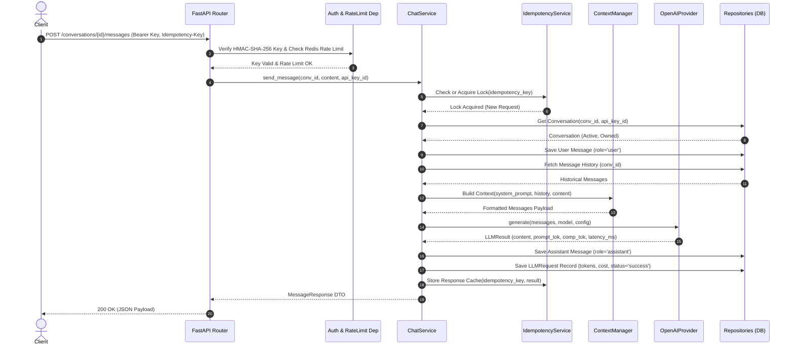
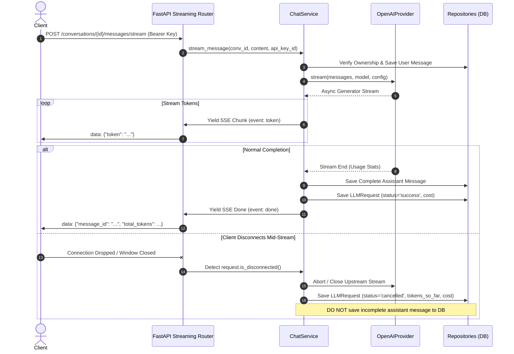

# System Architecture Specification

## 1. Executive Summary

The **AI Chat API** is a production-grade, multi-tenant conversational backend built with FastAPI, PostgreSQL, Redis, and the OpenAI API. It provides a robust HTTP and Server-Sent Events (SSE) interface for managing conversation threads, streaming model tokens, maintaining conversation context, auditing LLM consumption, enforcing API-key level tenant boundaries, and executing sliding-window rate limiting.

---

## 2. Layered Architectural Model

The system enforces a strict unidirectional layered architecture:

```
[ HTTP Client / Frontend ]
          │ (HTTP / SSE with Bearer Auth & Idempotency-Key)
          ▼
┌──────────────────────────────────────────────────────────┐
│                     FastAPI Layer                        │
│  - RequestIDMiddleware (Context propagation)             │
│  - StructuredLoggingMiddleware (HTTP access metrics)    │
│  - Dependencies (HMAC Auth, Redis Rate Limiter, Pool)    │
│  - API Routers (/api/v1/conversations, /messages, etc.)  │
└─────────────────────────┬────────────────────────────────┘
                          │ (Validated DTOs / Domain Models)
                          ▼
┌──────────────────────────────────────────────────────────┐
│                     Service Layer                        │
│  - ConversationService (Tenant isolation & lifecycle)    │
│  - ChatService (Context assembly, LLM dispatch, SSE)     │
│  - CostCalculatorService (Pricing matrix calculations)   │
│  - IdempotencyService (Redis distributed locks & cache)  │
│  - RateLimiterService (Redis sliding-window tracker)     │
└──────────────┬────────────────────────────┬──────────────┘
               │                            │
               ▼                            ▼
┌───────────────────────────────┐ ┌────────────────────────┐
│       Repository Layer        │ │   LLM Abstraction      │
│  - ConversationRepository     │ │  - ContextManager      │
│  - MessageRepository          │ │  - LLMProvider (Base)  │
│  - LLMRequestRepository       │ │  - OpenAIProvider      │
│  - APIKeyRepository           │ │  - MockLLMProvider     │
└──────────────┬────────────────┘ └──────────┬─────────────┘
               │ (SQLAlchemy 2.x Async)     │ (Async Streams)
               ▼                            ▼
┌───────────────────────────────┐ ┌────────────────────────┐
│     PostgreSQL Database       │ │       OpenAI API       │
└───────────────────────────────┘ └────────────────────────┘
```

### 2.1 Layer Responsibilities

1. **API / Transport Layer (`app/api/v1/`)**:
   * Accepts incoming HTTP requests, validates payloads against Pydantic schemas, and extracts headers (`Authorization`, `Idempotency-Key`, `X-Request-ID`).
   * Handles HTTP-specific status codes and response headers.
   * Dispatches business execution directly to the Service layer. Never accesses Repositories or raw database sessions directly.

2. **Service Layer (`app/services/`)**:
   * Encapsulates domain business logic, transactional boundaries, and multi-tenant authorization rules.
   * `ConversationService`: Enforces that `api_key_id` owns the conversation before allowing read/update/delete operations.
   * `ChatService`: Coordinates context history retrieval, idempotency validation, exponential retry with jitter for upstream LLM calls, streaming async generators, and post-generation persistence.
   * `CostCalculatorService`: Evaluates input and output token counts against model pricing rules to compute costs in USD.
   * `IdempotencyService`: Implements atomic lock acquisition and response caching in Redis.

3. **Repository Layer (`app/repositories/`)**:
   * Isolates SQLAlchemy 2.0 async queries from domain logic.
   * Provides clean abstractions for queries, filtering out soft-deleted records by default (`deleted_at IS NULL`).
   * Enforces composite index alignment for fast sorting and tenant filtering.

4. **LLM Provider Layer (`app/llm/`)**:
   * Isolates third-party model SDKs behind an abstract interface (`LLMProvider`).
   * `ContextManager`: Manages token budgets, formats historical turns (`system`, `user`, `assistant`), and handles context truncation.
   * `OpenAIProvider`: Implements `openai.AsyncOpenAI` client calls with timeout handling, cancellation checks, and domain exception translation.
   * `MockLLMProvider`: Deterministic provider for fast, reproducible, and zero-cost testing.

---

## 3. End-to-End Request Lifecycles

### 3.1 Synchronous Message Flow



---

### 3.2 Streaming Message Flow & Disconnect Cancellation



---

## 4. Multi-Tenant Security & Isolation

1. **HMAC-SHA-256 Key Hashing**:
   * API keys are never stored in plaintext.
   * Incoming `Bearer <raw_key>` is hashed using `HMAC-SHA-256(key=settings.API_KEY_SECRET, msg=raw_key)`.
   * Constant-time comparison ensures protection against timing attacks.
   * Server-side secret pepper prevents offline rainbow table attacks if the database is compromised.

2. **Tenant Ownership Verification**:
   * Every conversation record contains `api_key_id`.
   * Queries strictly enforce `WHERE api_key_id = :current_api_key_id AND deleted_at IS NULL`.
   * Cross-tenant access attempts return `404 Not Found` rather than `403 Forbidden` to prevent resource enumeration attacks.

---

## 5. Distributed Idempotency & Rate Limiting

1. **Sliding-Window Rate Limiting**:
   * Maintained in Redis using sorted sets (`ZSET`) keyed by `ratelimit:{api_key_id}`.
   * Window: 60 seconds. Default limit: 100 requests.
   * Removes entries older than `now - 60s`, counts remaining entries, and records current timestamp with atomic pipeline operations.

2. **Idempotency Architecture**:
   * Clients pass optional `Idempotency-Key: <unique-identifier>`.
   * Key in Redis: `idemp:{api_key_id}:{idempotency_key}`.
   * State transitions:
     * `IN_PROGRESS`: Key locked with TTL (60s). Concurrent duplicate requests receive `409 Conflict`.
     * `COMPLETED`: Stores response JSON payload with TTL (24 hours). Subsequent requests receive the cached response immediately without calling the LLM or billing the user again.
