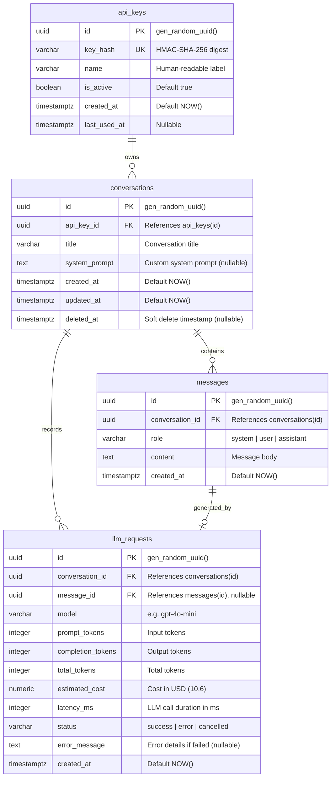

# Database Design & Relational Schema

## 1. Relational Architecture Overview

The database is built on **PostgreSQL 16+** using SQLAlchemy 2.0 async declarative models. It models conversations, messages, LLM execution audits, and hashed API keys with strict relational integrity, composite indexing, and multi-tenant isolation.

---

## 2. Entity-Relationship Diagram (ERD)



---

## 3. Detailed Table Definitions

### 3.1 `api_keys`
Stores client API key credentials as HMAC-SHA-256 digests.

| Column | Type | Constraints | Description |
| :--- | :--- | :--- | :--- |
| `id` | `UUID` | `PRIMARY KEY`, default `gen_random_uuid()` | Unique API key ID |
| `key_hash` | `VARCHAR(64)` | `NOT NULL`, `UNIQUE` | Hexadecimal HMAC-SHA-256 hash |
| `name` | `VARCHAR(100)` | `NOT NULL` | Description or client name |
| `is_active` | `BOOLEAN` | `NOT NULL`, default `TRUE` | Activation flag |
| `created_at` | `TIMESTAMPTZ` | `NOT NULL`, default `NOW()` | Key generation timestamp |
| `last_used_at`| `TIMESTAMPTZ` | `NULL` | Updated on authenticated requests |

* **Indexes**:
  * `uq_api_keys_key_hash`: Unique B-Tree index for $O(1)$ key authentication lookups.

---

### 3.2 `conversations`
Stores conversation thread metadata and tenant ownership.

| Column | Type | Constraints | Description |
| :--- | :--- | :--- | :--- |
| `id` | `UUID` | `PRIMARY KEY`, default `gen_random_uuid()` | Conversation ID |
| `api_key_id` | `UUID` | `NOT NULL`, `REFERENCES api_keys(id)` | Tenant owner foreign key |
| `title` | `VARCHAR(255)` | `NOT NULL` | Title of the conversation |
| `system_prompt`| `TEXT` | `NULL` | Conversation-specific system prompt |
| `created_at` | `TIMESTAMPTZ` | `NOT NULL`, default `NOW()` | Creation timestamp |
| `updated_at` | `TIMESTAMPTZ` | `NOT NULL`, default `NOW()` | Last message/update timestamp |
| `deleted_at` | `TIMESTAMPTZ` | `NULL` | Soft deletion timestamp |

* **Indexes**:
  * `idx_conversations_api_key_created`: Composite index `(api_key_id, created_at DESC)` for paginated listing of tenant conversations.
  * `idx_conversations_api_key_deleted`: Composite index `(api_key_id, deleted_at)` to accelerate active conversation filtering.

---

### 3.3 `messages`
Stores individual conversation turns sequentially.

| Column | Type | Constraints | Description |
| :--- | :--- | :--- | :--- |
| `id` | `UUID` | `PRIMARY KEY`, default `gen_random_uuid()` | Message ID |
| `conversation_id` | `UUID` | `NOT NULL`, `REFERENCES conversations(id)` | Conversation reference |
| `role` | `VARCHAR(20)` | `NOT NULL` (`system`, `user`, `assistant`) | Message author role |
| `content` | `TEXT` | `NOT NULL` | Text body of the message |
| `created_at` | `TIMESTAMPTZ` | `NOT NULL`, default `NOW()` | Message timestamp |

* **Indexes**:
  * `idx_messages_conv_created`: Composite index `(conversation_id, created_at ASC)` for fast in-order prompt context reconstruction.

---

### 3.4 `llm_requests`
Audit log of every external LLM interaction, token count, latency, and cost calculation.

| Column | Type | Constraints | Description |
| :--- | :--- | :--- | :--- |
| `id` | `UUID` | `PRIMARY KEY`, default `gen_random_uuid()` | Request audit ID |
| `conversation_id` | `UUID` | `NOT NULL`, `REFERENCES conversations(id)` | Conversation reference |
| `message_id` | `UUID` | `NULL`, `REFERENCES messages(id)` | Assistant message reference |
| `model` | `VARCHAR(100)` | `NOT NULL` | Model identifier (e.g. `gpt-4o-mini`) |
| `prompt_tokens` | `INTEGER` | `NOT NULL` | Input prompt tokens |
| `completion_tokens` | `INTEGER` | `NOT NULL` | Output generated tokens |
| `total_tokens` | `INTEGER` | `NOT NULL` | Total tokens consumed |
| `estimated_cost` | `NUMERIC(10,6)` | `NOT NULL` | Estimated cost in USD |
| `latency_ms` | `INTEGER` | `NOT NULL` | LLM invocation duration in ms |
| `status` | `VARCHAR(20)` | `NOT NULL` (`success`, `error`, `cancelled`) | Execution outcome |
| `error_message` | `TEXT` | `NULL` | Error details if failed |
| `created_at` | `TIMESTAMPTZ` | `NOT NULL`, default `NOW()` | Invocation timestamp |

* **Indexes**:
  * `idx_llm_requests_conv_id`: Index on `(conversation_id)` for computing aggregate conversation costs.
  * `idx_llm_requests_created_at`: Index on `(created_at DESC)` for time-series financial analysis.

---

## 4. Query Patterns & Performance Alignment

1. **Context Reconstruction Query**:
   ```sql
   SELECT role, content 
   FROM messages 
   WHERE conversation_id = :conv_id 
   ORDER BY created_at ASC;
   ```
   * *Index used*: `idx_messages_conv_created (conversation_id, created_at ASC)`.
   * *Performance*: Index-only scan, executing in $< 1\text{ ms}$.

2. **Paginated Tenant Conversation List**:
   ```sql
   SELECT id, title, system_prompt, created_at, updated_at
   FROM conversations 
   WHERE api_key_id = :current_api_key_id AND deleted_at IS NULL 
   ORDER BY created_at DESC 
   LIMIT :page_size OFFSET :offset;
   ```
   * *Index used*: `idx_conversations_api_key_created (api_key_id, created_at DESC)`.
   * *Performance*: Direct index range scan, executing in $< 2\text{ ms}$.

3. **Authentication Lookup**:
   ```sql
   SELECT id, name, is_active 
   FROM api_keys 
   WHERE key_hash = :hmac_hash AND is_active = TRUE;
   ```
   * *Index used*: `uq_api_keys_key_hash`.
   * *Performance*: Single-row unique B-Tree lookup in $< 0.5\text{ ms}$.

---

## 5. Migrations & Seed Dataset Strategy

* **Alembic Async Migrations**: Migrations are version-controlled in `migrations/versions/`. The migration environment connects asynchronously using `asyncpg`.
* **Database Seeding (`scripts/seed_db.py`)**: Loads `data/seed/conversations.json` containing $\ge 50$ conversations and inserts them within a single transaction tied to a default development API key.
